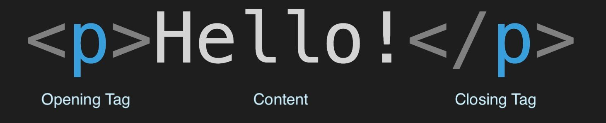
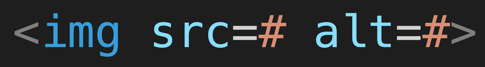
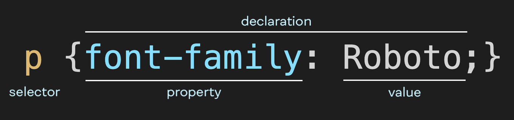
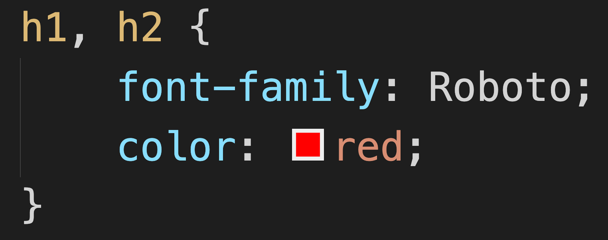

<!-- instructor's notes -->

# Sprint 1
## HTML & CSS Basics

--- 

## Lecture Outline

1. HTML Basics
2. Common HTML Elements & Structure
3. HTML Demo
4. CSS Basics
5. Common CSS Selectors & Properties
6. CSS Demo

---

## 1. HTML Basics

---

### What is HTML?

**HyperText Markup Language (HTML)** is used to define the meaning of content to be shared on the web. We use HTML to "markup" things like text and images so they can be displayed in a web browser. 

[Empty / Self-Closing Tag](https://developer.mozilla.org/en-US/docs/Glossary/Empty_element)


+ HTML is basically the skeleton of our webpage that gets rendered to our client
+ An empty element is an element from HTML, SVG, or MathML that cannot have any child nodes (i.e., nested elements or text nodes).

---

## 2. Common HTML Elements & Structure

---

* head holds all the info that our browser needs and body holds all the info that our client needs
* head tag is diff from header tag

```html
<!DOCTYPE html>
<html>
  <head>
    <!-- meta data -->
        <title>Cafe Market | Menu </title>
  </head>
  <body>
    <!-- content of the webpage -->
    <h1>Today's Menu</h1>
    <h2>Beverages</h2>
    <p>Below is our selection of coffee, tea, and other drinks.</p>
    <h3>Coffee</h3>
    <ul>
        <li>Espresso</li>
        <li>Latte</li>
        <li>Cold Brew</li>
    </ul>
    <h3>Tea</h3>
    <ul>
        <li>Green</li>
        <li>Oolong</li>
        <li>Earl Grey</li>
    </ul>
  </body>
</html>
```

---

## Tags for creating semantic page structure

`<div>` - stands for "division"; defines a division or a section in an HTML document.
`<header>` - generally used to contain logo, banner image, navigation, etc. at the top of the page.
`<nav>` - contains the navigation (i.e., links) to assist in navigating the website.
`<section>` - contains a grouping of related content elements.
`<article>` - contains discrete, self-contained content that could be redistributed. 
`<aside>` - contains content that is indirectly related to the main content within the section.
`<footer>` - generally contains information about the site, such as site owner, contact information, copyright, etc.

+ Using specific semantic elements improves the accessibility of our webpage and helps our potential audience with disability and has trouble with vision. Using the screen reader, our users with disability can visualise our webpage more easily.

---

There are different types of elements:

## Block Elements vs Inline Elements

* Block elements take over the entire row, inline elements don't.
* [HTML Block and Inline Elements](https://www.w3schools.com/html/html_blocks.asp)

---

## 3. HTML Demo

<!-- Present the HTML portion of the demo of your choice. -->

---

## 4. CSS Basics

---

# What is CSS?

**Cascading Style Sheets (CSS)** is the language used to define how HTML elements are visually rendered on screen. That is to say, we use CSS to add style and layout to the content of our web pages.



+ If HTML is a frame of a car, CSS is the design of the car - what color is this car? How many doors does it have? How big are the windows? JavaScript is the engine of the car. Using JavaScript, we can make it move! So far we've built a frame, and now we're going to apply styles to it.

---

## 5. Common CSS Selectors & Properties

* [Selectors](https://developer.mozilla.org/en-US/docs/Web/CSS/CSS_Selectors)
* [Properties](https://css-tricks.com/almanac/properties/)


---

## 6. CSS Demo

<!-- Present the CSS portion of the demo of your choice. -->

---

## To-Do List
1. Sprint 2
2. Make sure to join Replit team, if you don't have access to it make sure to slack me your email and/or Replit username.
3. The Bean Machine on Replit

+ Let's go over how to use Replit.

---

## Resources
* [HTML + CSS Basics](https://mimodocs.notion.site/HTML-CSS-Basics-609a1ed349e248b4b3c3c296b87c4817)
* [Mimo Glossery HTML](https://getmimo.com/glossary/html/attributes)
* [MDN HTML](https://developer.mozilla.org/en-US/docs/Web/HTML)
* [MDN CSS](https://developer.mozilla.org/en-US/docs/Web/CSS)
* [CSS Syntax](https://developer.mozilla.org/en-US/docs/Glossary/property/CSS)
* [HTML encoder/decoder](https://www.w3docs.com/tools/html-encoder/)