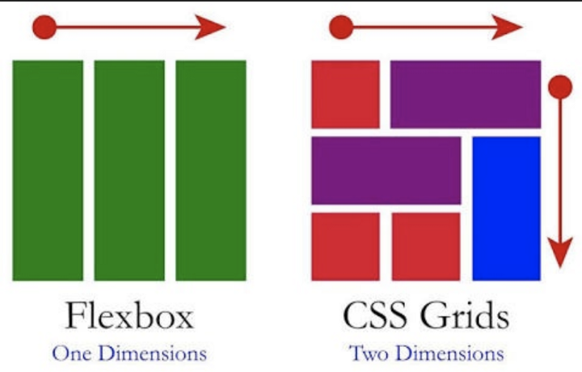

# Sprint 2
## CSS Grid

--- 

## Lecture Outline

1. Grid Basics
2. Flex VS. Grid
3. Common Grid Properties
4. Grid Demo 

---

## 1. Grid Basics

* The CSS Grid Layout is a two-dimensional grid-based layout system with rows and columns. It is useful in creating more complex and organized layouts.

* To define a grid container, you will have to pass a display: grid property to your element.

* [CSS Grid Vs. Flexbox](https://www.simplilearn.com/tutorials/css-tutorial/css-grid-vs-flexbox#:~:text=Flexbox%20is%20made%20for%20one,Grids%20can%20work%20on%20both.)

---

## 2. Flex VS. Grid

* Flexbox is made for one-dimensional layouts vs. grid is made for two-dimensional layouts.
* Flexbox can work on either rows or columns at a time vs. grid can work on both.

<!-- To create a grid-like layout by only using flex, you'd have to create multiple flex containers nested under another flex container. Using grid you only need to create 1 container, which makes it suitable for a more complex layout. -->

---

## 3. Common Grid Properties

* `grid-template-columns` specifies the number (and the widths) of columns in a grid layout.
* `grid-template-rows` specifies the number (and the heights) of the rows in a grid layout.
* `grid-auto-rows` sets a size for the rows in a grid container.
* `grid-column-gap` defines the size of the gap between the columns in a grid layout.
* `grid-row-gap` defines the size of the gap between the rows in a grid layout.

---

* `grid-gap` defines the size of the gap between the rows and columns in a grid layout
* `grid-template-areas` specifies areas within the grid layout.
* `grid-area` specifies a grid item's size and location in a grid layout
* `grid-column-start` defines on which column-line the item will start.
* `grid-column-end` defines how many columns an item will span, or on which column-line the item will end

* [CSS Grid Layout Module](https://www.w3schools.com/css/css_grid.asp)
* [CSS grid Property](https://www.w3schools.com/cssref/pr_grid.asp)

---

## 4. Grid Demo

---

## To-Do List
1. Sprint 5
2. Portfolio Project #2: Sweet Berries Cooking School
3. If you haven't already, schedule 1-on-1 with me to receive a written ✨code review✨ on the Bean Machine project! 

---

## Resources
* [W3Schools - CSS Grid Layout Module](https://www.w3schools.com/css/css_grid.asp)
* [W3Schools - CSS grid Property](https://www.w3schools.com/cssref/pr_grid.asp)
* [MDN - grid-template-areas](https://developer.mozilla.org/en-US/docs/Web/CSS/grid-template-areas)

